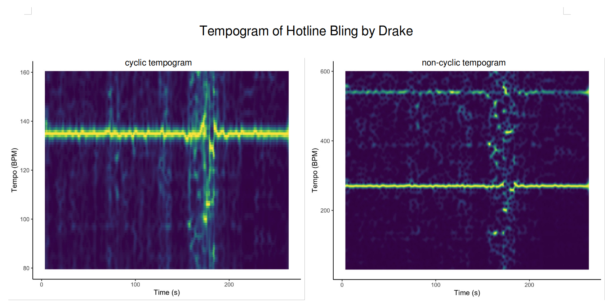

```{r setup, include=FALSE}
library(flexdashboard)
library(compmus)
library(spotifyr)
library(dplyr)
library(ggplot2)
library(tidyverse)
library(ggpubr)
library(plotly)
library(recipes)
library(rsample)
library(parsnip)
library(tune)
library(tidymodels)

tracks90 <- get_playlist_tracks("37i9dQZF1DX186v583rmzp")
features90 <- get_track_audio_features(tracks90$track.id)

tracks10 <- get_playlist_tracks("37i9dQZF1DWSMW5YBCZisa")
features10 <- get_track_audio_features(tracks10$track.id)

tracks15 <- get_playlist_tracks("37i9dQZF1DXcqWbpeXswkc")
features15 <- get_track_audio_features(tracks15$track.id)

features10$year <- "2010"
features15$year <- "2010"
features90$year <- "1990"

tracks10 <- tracks10 %>% mutate(artists.name = map_chr(track.album.artists, function(x) x$name[1]))
tracks15 <- tracks15 %>% mutate(artists.name = map_chr(track.album.artists, function(x) x$name[1]))
tracks90 <- tracks90 %>% mutate(artists.name = map_chr(track.album.artists, function(x) x$name[1]))

features10$artists.name <- tracks10$artists.name
features90$artists.name <- tracks90$artists.name
features15$artists.name <- tracks15$artists.name

features10$track.name <- tracks10$track.name
features90$track.name <- tracks90$track.name
features15$track.name <- tracks15$track.name

features <- rbind(rbind(features90, features10), features15)

hiphop90 <-
  get_playlist_audio_features(
    "spotify",
    "37i9dQZF1DX186v583rmzp"
  ) %>%
  add_audio_analysis()
hiphop10 <-
  get_playlist_audio_features(
    "spotify",
    "37i9dQZF1DWSMW5YBCZisa"
  ) %>%
  add_audio_analysis()
hiphop15 <-
  get_playlist_audio_features(
    "spotify",
    "37i9dQZF1DXcqWbpeXswkc"
  ) %>%
  add_audio_analysis()

hiphop <- 
  hiphop90 %>%
  mutate(year = "1990") %>%
  bind_rows(hiphop10 %>% mutate(year = "2010")) %>%
  bind_rows(hiphop15 %>% mutate(year = "2010"))
```

### **Introduction:** The shift of Hip-Hop {data-commentary-width=600}
**Chosen Corpus**
I will be using three Spotify playlists, namely ["Best Rap Songs of 2010"](https://open.spotify.com/playlist/37i9dQZF1DX38t16fuNXJJ?si=4f83c993c8904728), ["Best Rap Songs of 2015"](https://open.spotify.com/playlist/37i9dQZF1DXcqWbpeXswkc?si=7246210a99d641d7) and ["I Love My '90s Hip-Hop"](https://open.spotify.com/playlist/37i9dQZF1DX186v583rmzp?si=9ea41443c20e40f1). They respectively have fifty, fifty, and a hundred songs in them. I chose this corpus, since I am a big fan of '90s Hip-Hop and I am curious how the Hip-Hop genre has changed in the next two decades. The two playlists from the '10s will represent this decade together. The research question I will try to answer in this storyboard is: What are the measurable differences between 1990's and 2010's Hip-Hop?

**Characteristics of the Corpus**
Both playlists consist of various artists and albums. They only have the genre in common: Hip-Hop. I expect Hip-Hop songs from the '90s to be more alike, as they often use samples or jazz influences in their songs. I also expect Hip-Hop songs from the 2010's to have a higher danceability, as the Hip-Hop genre became more widely made, so that it may have gotten more pop influences. 
The '90s playlist has tracks from 1990 up until 1999, the '10s playlists have a less equally distributed year range. Fifty tracks are from 2010 and the other fifty tracks are from 2015. 

**Representativeness of the Corpus**
All playlists consist of a broad range of different artists from their decade, but also some songs of the same artists. This could be a limitation of the corpus. 

**Typical and Atypical Tracks**
A typical track from the '90s playlist is [Do for Love by 2Pac](https://open.spotify.com/track/4AE7Lj39VnSZNOmGH2iZaq?si=d1ee18d3341a4cee). It uses a sample and from the '70s and has very meaningful lyrics. An atypical track from the '90s playlist is [Insane in the Brain by Cypress Hill](https://open.spotify.com/track/1oTHteQbmJw15rPxPVXUTv?si=330f37b1dad84b14), as it has a very different vibe as opposed to the other songs in the playlist. A typical track from the 10's playlist is [Black and Yellow by Wiz Khalifa](https://open.spotify.com/track/5A6OHHy73AR5tLxgTc98zz?si=da8ff8a2f0c94606), as it has more structure (combination of verses and choruses), singing, and electronic music. An atypical track from the '10s playlist is [Kool Aid and Frozen Pizza by Mac Miller](https://open.spotify.com/track/3VmrLy4WZLHDgTXENCIz2p?si=eac28e568d0840b8). It uses a sample from the Hip 2 Da Game by Lord Finesse song, which is a song in the '90s playlist. Almost no other song in the 2010's playlist uses a sample, which makes this track unique. 

***

<iframe src="https://open.spotify.com/embed/playlist/37i9dQZF1DWSMW5YBCZisa?theme=0" width="50%" height="380" frameBorder="0" allowtransparency="true" allow="encrypted-media"></iframe>

<iframe src="https://open.spotify.com/embed/playlist/37i9dQZF1DXcqWbpeXswkc?theme=0" width="50%" height="380" frameBorder="0" allowtransparency="true" allow="encrypted-media"></iframe>

<iframe src="https://open.spotify.com/embed/playlist/37i9dQZF1DX186v583rmzp?theme=0" width="100%" height="380" frameBorder="0" allowtransparency="true" allow="encrypted-media"></iframe>

### Less rapping and more singing: How is the **speechiness** of songs affected? {data-commentary-width=400}

```{r}
features %>% 
  plot_ly(x = ~year, y = ~speechiness, color = I("#E69F00"), 
          hoverinfo = "text", text = ~paste("Song:", track.name, "<br>", "Artist(s):", artists.name), 
          marker = list(color = "#999999")) %>%
  add_boxplot() %>% 
  add_markers() %>% 
  layout(showlegend = FALSE,
         title = "Speechiness Distribution"
         )
```

***

This first plot shows the distribution of Spotify's speechiness feature of both playlists. This feature detects the presence of spoken words in a track and is given by a value between zero and one. 

The whole interquartile range of '90s songs lies above the median of the '10s songs. I deduct from this that the speechiness of '90s songs is mostly higher than '10s songs. The songs from 1990 also seem to have a more equal distribution than songs from 2010, which also seem to have a higher concentration of songs with lower speechiness and an outlier. 

A possible cause of this could be the "popifying" of Hip-Hop and adding more singing to the tracks. A very clear theme in '90s Hip-Hop is that the rap is the main focus in the song. This means a lot of words and not a lot of room for just music, probably giving a high speechiness. This "popifying" therefore could result in a lower speechiness, because singing allows more room for music. 

### Is there need for an increased **tempo** in Hip-Hop music? {data-commentary-width=400}

```{r}
features_selected <- features %>% select(tempo, year)

meanTempo <- features_selected %>% group_by(year) %>% summarize(mean.tempo = mean(tempo))

tempoPlot <- ggplot(features_selected, aes(x = tempo, fill = year, color = year)) +
  geom_histogram(binwidth = 10, position = "identity", alpha = 0.6) + 
  theme_gray() +
  geom_vline(data=meanTempo, aes(xintercept = mean.tempo, color= year), linetype="dashed", show.legend = F) +
  geom_text(aes(x = mean.tempo + 8, y = 50, label = round(mean.tempo, 2), color = year), data = meanTempo) +
  labs(
    title = "Tempo Distribution",
    x = "Tempo",
    y = "Count"
  ) +
  scale_color_manual(values=c("#999999", "#E69F00")) +
  scale_fill_manual(values=c("#999999", "#E69F00")) +
  theme(plot.title = element_text(size=12, hjust = 0.5))
tempoPlot
```

***

This next plot shows the tempo distribution of the tracks in the 1990's and the 2010's playlist. The vertical interrupted lines show the mean tempo of each playlist. The tempo is represented as beats per minute (BPM).  

The '90s playlist shows a very large concentration of song between 75 and 105 BPM, whilst the '10s playlist shows a more equally distributed tempo histogram. The '90s songs do have some songs of higher BPM, but not nearly as many as the '10s songs. The '10s songs also have a higher mean BPM than the '90s songs. 

This shift in tempo could again be attributed to Hip-Hop becoming more popular and widely made: popifying the sound. The average tempo of pop songs in 2020 lays around 120 BPM, which is slightly lower than the average tempo of the '10s songs.  

### Making songs more **structured**

```{r}
antidote <-
  get_tidy_audio_analysis("1wHZx0LgzFHyeIZkUydNXq") %>% # Change URI.
  compmus_align(bars, segments) %>%                     # Change `bars`
  select(bars) %>%                                      #   in all three
  unnest(bars) %>%                                      #   of these lines.
  mutate(
    pitches =
      map(segments,
        compmus_summarise, pitches,
        method = "rms", norm = "euclidean"              # Change summary & norm.
      )
  ) %>%
  mutate(
    timbre =
      map(segments,
        compmus_summarise, timbre,
        method = "rms", norm = "euclidean"              # Change summary & norm.
      )
  )

antidoteTimbrePlot <- antidote %>%
  compmus_self_similarity(timbre, "cosine") %>% 
  ggplot(
    aes(
      x = xstart + xduration / 2,
      width = xduration,
      y = ystart + yduration / 2,
      height = yduration,
      fill = d
    )
  ) +
  geom_tile() +
  coord_fixed() +
  scale_fill_viridis_c(guide = "none") +
  theme_classic() +
  labs(x = "", y = "Antidote", title = "Timbre") +
  theme(plot.title = element_text(size=12, hjust = 0.5))

antidoteChromaPlot <- antidote %>%
  compmus_self_similarity(pitches, "cosine") %>% 
  ggplot(
    aes(
      x = xstart + xduration / 2,
      width = xduration,
      y = ystart + yduration / 2,
      height = yduration,
      fill = d
    )
  ) +
  geom_tile() +
  coord_fixed() +
  scale_fill_viridis_c(guide = "none") +
  theme_classic() +
  labs(x = "", y = "", title = "Chroma") +
  theme(plot.title = element_text(size=12, hjust = 0.5))


qtip <-
  get_tidy_audio_analysis("4UZlEcQmkAeh4mYokk8TNs") %>% # Change URI.
  compmus_align(bars, segments) %>%                     # Change `bars`
  select(bars) %>%                                      #   in all three
  unnest(bars) %>%                                      #   of these lines.
  mutate(
    pitches =
      map(segments,
        compmus_summarise, pitches,
        method = "rms", norm = "euclidean"              # Change summary & norm.
      )
  ) %>%
  mutate(
    timbre =
      map(segments,
        compmus_summarise, timbre,
        method = "rms", norm = "euclidean"              # Change summary & norm.
      )
  )

qtipTimbrePlot <- qtip %>%
  compmus_self_similarity(timbre, "cosine") %>% 
  ggplot(
    aes(
      x = xstart + xduration / 2,
      width = xduration,
      y = ystart + yduration / 2,
      height = yduration,
      fill = d
    )
  ) +
  geom_tile() +
  coord_fixed() +
  scale_fill_viridis_c(guide = "none") +
  theme_classic() +
  labs(x = "", y = "Let's Ride") +
  theme(plot.title = element_text(size=12, hjust = 0.5))

qtipChromaPlot <- qtip %>%
  compmus_self_similarity(pitches, "cosine") %>% 
  ggplot(
    aes(
      x = xstart + xduration / 2,
      width = xduration,
      y = ystart + yduration / 2,
      height = yduration,
      fill = d
    )
  ) +
  geom_tile() +
  coord_fixed() +
  scale_fill_viridis_c(guide = "none") +
  theme_classic() +
  labs(x = "", y = "") +
  theme(plot.title = element_text(size=12, hjust = 0.5))

figure <- ggarrange(antidoteTimbrePlot, antidoteChromaPlot, qtipTimbrePlot, qtipChromaPlot, ncol = 2, nrow = 2, common.legend = TRUE)

annotate_figure(figure, top = text_grob("Self-similarity matrices", 
               color = "black", size = 14))
```

***
<iframe src="https://open.spotify.com/embed/track/4UZlEcQmkAeh4mYokk8TNs?theme=0" width="100%" height="80" frameBorder="0" allowtransparency="true" allow="encrypted-media"></iframe>
<iframe src="https://open.spotify.com/embed/track/1wHZx0LgzFHyeIZkUydNXq?theme=0" width="100%" height="80" frameBorder="0" allowtransparency="true" allow="encrypted-media"></iframe>

Here I show two types of self-similarity matrices: timbre and chroma self-similarity matrices. The first row is of the song Antidote by Travis Scott and the second row is of the song Let's Ride by Q-Tip.

Antidote has a clear checkerboard pattern in the chroma matrix, which is caused by alternation of verses and choruses. He is singing more than rapping with a repetitive melody. The whole song has the same instrumentation which could be the reason why the timbre matrix shows very little variation. 

Both chroma and timbre matrices for Let's Ride show very little variation. The song has a constant beat and is very rap orientated. In contrary to Antidote, this song has no alternation between verses and choruses. 

These matrices support the idea that there is a shift from the more rap and beat based '90s songs to the more popified way of making Hip-Hop (having the standard verse/chorus/bridge layout). Of course this is not the case for all songs, but it is a noticeable change.


### The music may have a different vibe, but is this also visible in the **timbre**?

```{r}
hiphop %>%
  mutate(
    timbre =
      map(
        segments,
        compmus_summarise,
        timbre,
        method = "mean"
      )
  ) %>%
  select(year, timbre) %>%
  compmus_gather_timbre() %>%
  ggplot(aes(x = basis, y = value, fill = year)) +
  geom_violin() +
  theme_gray() + 
  scale_color_manual(values=c("#999999", "#E69F00")) +
  scale_fill_manual(values=c("#999999", "#E69F00")) +
  labs(x = "Spotify Timbre Coefficients", y = "Loudness", fill = "Year", title = "Average Timbre Coefficients") +
  theme(plot.title = element_text(size=12, hjust = 0.5))
```

***

Here I present a violin plot that shows how present each one of the twelve Spotify timbre coefficients is in the dataset. 

The tracks from the '90s and '10s show a very similar distribution of coefficients. The third coefficient, which represents the flatness of a sound, seems to have some lower values of loudness in the '90s playlist. Coefficient seven and twelve seem to have their main concentration of loudness in slightly different spots. 

'90s Hip-Hop tends to use real instruments (e.g. jazz samples) in their songs and '10s Hip-Hop is more electronic. So I expected this plot to show that different timbre coefficients would be more present in both playlists. 

### How well can '90s and '10s Hip-Hop tracks be **classified**? {data-commentary-width=600}

```{r}
get_conf_mat <- function(fit) {
  outcome <- .get_tune_outcome_names(fit)
  fit %>% 
    collect_predictions() %>% 
    conf_mat(truth = outcome, estimate = .pred_class)
}  

get_pr <- function(fit) {
  fit %>% 
    conf_mat_resampled() %>% 
    group_by(Prediction) %>% mutate(precision = Freq / sum(Freq)) %>% 
    group_by(Truth) %>% mutate(recall = Freq / sum(Freq)) %>% 
    ungroup() %>% filter(Prediction == Truth) %>% 
    select(class = Prediction, precision, recall)
}  

hiphop_features <-
  hiphop %>%
  mutate(
    year = factor(year),
    segments = map2(segments, key, compmus_c_transpose),
    pitches =
      map(
        segments,
        compmus_summarise, pitches,
        method = "mean", norm = "manhattan"
      ),
    timbre =
      map(
        segments,
        compmus_summarise, timbre,
        method = "mean",
      )
  ) %>%
  mutate(pitches = map(pitches, compmus_normalise, "clr")) %>%
  mutate_at(vars(pitches, timbre), map, bind_rows) %>%
  unnest(cols = c(pitches, timbre))

hiphop_recipe <-
  recipe(
    year ~
      danceability +
      energy +
      loudness +
      speechiness +
      acousticness +
      instrumentalness +
      liveness +
      valence +
      tempo +
      duration +
      C + `C#|Db` + D + `D#|Eb` +
      E + `F` + `F#|Gb` + G +
      `G#|Ab` + A + `A#|Bb` + B +
      c01 + c02 + c03 + c04 + c05 + c06 +
      c07 + c08 + c09 + c10 + c11 + c12,
    data = hiphop_features,          # Use the same name as the previous block.
  ) %>%
  step_center(all_predictors()) %>%
  step_scale(all_predictors())      # Converts to z-scores.
  # step_range(all_predictors())    # Sets range to [0, 1].

hiphop_cv <- hiphop_features %>% vfold_cv(5)

forest_model <-
  rand_forest() %>%
  set_mode("classification") %>% 
  set_engine("ranger", importance = "impurity")

hiphop_forest <- 
  workflow() %>% 
  add_recipe(hiphop_recipe) %>% 
  add_model(forest_model) %>% 
  fit_resamples(
    hiphop_cv, 
    control = control_resamples(save_pred = TRUE)
  )

hiphop_forest %>%
  get_conf_mat() %>% 
  autoplot(type="heatmap") + labs(title="Confusion Matrix")
```

***

So far I have already discussed some distinguishing characteristics between Hip-Hop from the '90s and the '10s, such as tempo differences or structure in the songs. Here I made an algorithm use the Spotify features to classify if a song is from the '90s or the '10s. I tried the k-nearest neighbour model and the random forest model, where the second outperformed the first even when changing the amount of neighbours. 

On the left, the performance is shown. The diagonal shows how many recordings were classified correctly. This gives the random forest model a precision of about 0.869, recall of 0.86, and an accuracy of 0.865, which is decent for only having two classes. But which features were most important in making the decision from which decade the track was? In the plot below we can see that they are:

1. Tempo
2. Valence
3. Timbre coefficient 3
4. Timbre coefficient 7
5. Danceability

```{r}
workflow() %>% 
  add_recipe(hiphop_recipe) %>% 
  add_model(forest_model) %>% 
  fit(hiphop_features) %>% 
  pluck("fit", "fit", "fit") %>%
  ranger::importance() %>% 
  enframe() %>% 
  mutate(name = fct_reorder(name, value)) %>% 
  ggplot(aes(name, value)) + 
  geom_col() + 
  coord_flip() +
  theme_minimal() +
  labs(x = NULL, y = "Importance")
```

The fact that tempo is such an important denoter is not unexpected, as I have already shown the histogram distribution of tempo. The '90s songs show a heavy concentration of tempos at around 90-100BPM, whilst '10s songs have a more equal distribution. An unexpected important classifying feature is valence. 

### Conclusion

Making this portfolio I could combine two things I really like: music and programming. It also gave me more insights into Hip-Hop music than I could have hoped for. 

My analysis showed that, as expected, Hip-Hop did change quite a bit over the two decades. The average tempo increased, more singing was introduced (also by the rappers themselves), and the music became more electronic. All this "popified" Hip-Hop comparatively to its '90s counterpart. 

The fact that Hip-Hop is becoming more pop-like goes hand in hand with the genre becoming more widely known and loved, which is a positive thing. There may be more people making Hip-Hop now just because it is popular. However, you cannot lose sight of the fact that there are still rappers who make music from the heart, such as Kendrick Lamar. He is often hailed as one of the best rappers that ever existed, which I can relate to too.


I hope my portfolio might spark an interest in delving into Hip-Hop music. Whether it comes from the 90s or more recently, it remains a beautiful genre.

***

<iframe src="https://open.spotify.com/embed/track/0XRbYXQUymj9SJkrr8YK5B?theme=0" width="100%" height="380" frameBorder="0" allowtransparency="true" allow="encrypted-media"></iframe>
<iframe src="https://open.spotify.com/embed/track/3iVcZ5G6tvkXZkZKlMpIUs?theme=0" width="100%" height="380" frameBorder="0" allowtransparency="true" allow="encrypted-media"></iframe>

### Extra: **timbre** analysation of two songs

```{r}
icecube <-
  get_tidy_audio_analysis("67ncYmW29pNJJY2yXuLPwT") %>% # Change URI.
  compmus_align(bars, segments) %>%                     # Change `bars`
  select(bars) %>%                                      #   in all three
  unnest(bars) %>%                                      #   of these lines.
  mutate(
    pitches =
      map(segments,
        compmus_summarise, pitches,
        method = "rms", norm = "euclidean"              # Change summary & norm.
      )
  ) %>%
  mutate(
    timbre =
      map(segments,
        compmus_summarise, timbre,
        method = "rms", norm = "euclidean"              # Change summary & norm.
      )
  )

icecubePlot <- icecube %>%
  compmus_gather_timbre() %>%
  ggplot(
    aes(
      x = start + duration / 2,
      width = duration,
      y = basis,
      fill = value
    )
  ) +
  geom_tile() +
  labs(x = "Time (s)", y = NULL, fill = "Magnitude", title = "You Know How We Do It by Ice Cube") +
  scale_fill_viridis_c() + 
  theme_classic() +
  theme(plot.title = element_text(size=12, hjust = 0.5))

kidcudi <-
  get_tidy_audio_analysis("393MDhe62s8hbH8ETrlxe5") %>% # Change URI.
  compmus_align(bars, segments) %>%                     # Change `bars`
  select(bars) %>%                                      #   in all three
  unnest(bars) %>%                                      #   of these lines.
  mutate(
    pitches =
      map(segments,
        compmus_summarise, pitches,
        method = "rms", norm = "euclidean"              # Change summary & norm.
      )
  ) %>%
  mutate(
    timbre =
      map(segments,
        compmus_summarise, timbre,
        method = "rms", norm = "euclidean"              # Change summary & norm.
      )
  )

kidcudiPlot <- kidcudi %>%
  compmus_gather_timbre() %>%
  ggplot(
    aes(
      x = start + duration / 2,
      width = duration,
      y = basis,
      fill = value
    )
  ) +
  geom_tile() +
  labs(x = "Time (s)", y = NULL, fill = "Magnitude", title = "Mr. Rager by Kid Cudi") +
  scale_fill_viridis_c() +
  theme_classic() +
  theme(plot.title = element_text(size=12, hjust = 0.5))

figure <- ggarrange(icecubePlot, kidcudiPlot, ncol = 2, nrow = 1, common.legend = TRUE)

figure
```

***

<iframe src="https://open.spotify.com/embed/track/393MDhe62s8hbH8ETrlxe5?theme=0" width="100%" height="80" frameBorder="0" allowtransparency="true" allow="encrypted-media"></iframe>
<iframe src="https://open.spotify.com/embed/track/67ncYmW29pNJJY2yXuLPwT?theme=0" width="100%" height="80" frameBorder="0" allowtransparency="true" allow="encrypted-media"></iframe>

In this plot I show two songs with the lowest speechiness in my corpus. On the left a 1993 song called You Know How We Do It by Ice Cube and on the right a 2010 song called Mr. Rager by Kid Cudi. 

The left shows a quite constant presence of the c01 coefficient. Only the begin and end have a lower magnitude, as the song fades in and out. The constant presence of c01 can possibly be explained by the fact that the song has a constant beat with no choruses or verses. 

This is different in the right plot as the magnitude of c01 and c02 coefficients seem to alternate each other. These alternations exactly match the chorus and verse in the song. The c02 coefficient represents brightness, so the verses seem to have a higher brightness than the choruses. 

At about two hundred seconds in the right plot, it shows a high magnitude in the c02. This may be caused by the fact the singer starts singer higher and longer notes. 

Both songs seem to have a constant presence of the c06 coefficient. 


### Extra: **chromagram** of two songs {data-commentary-width=400}

```{r}
grownManSport <-
  get_tidy_audio_analysis("7Ie9W94M7OjPoZVV216Xus") %>%
  select(segments) %>%
  unnest(segments) %>%
  select(start, duration, pitches)

moment4Life <- 
  get_tidy_audio_analysis("0N3W5peJUQtI4eyR6GJT5O") %>%
  select(segments) %>%
  unnest(segments) %>%
  select(start, duration, pitches)

grownManSportChromagram <- grownManSport %>%
  mutate(pitches = map(pitches, compmus_normalise, "manhattan")) %>%
  compmus_gather_chroma() %>% 
  ggplot(
    aes(
      x = start + duration / 2,
      width = duration,
      y = pitch_class,
      fill = value
    )
  ) +
  geom_tile() +
  labs(x = "Time (s)", y = NULL, fill = "Magnitude", title = "Grown Man Sport by Pete Rock") +
  theme_minimal() +
  theme(plot.title = element_text(size=12, hjust = 0.5)) + 
  scale_fill_viridis_c()

moment4LifeChromagram <- moment4Life %>%
  mutate(pitches = map(pitches, compmus_normalise, "manhattan")) %>%
  compmus_gather_chroma() %>% 
  ggplot(
    aes(
      x = start + duration / 2,
      width = duration,
      y = pitch_class,
      fill = value
    )
  ) +
  geom_tile() +
  labs(x = "Time (s)", y = NULL, fill = "Magnitude", title = "King Kunta by Kendrick Lamar") +
  theme_minimal() +
  theme(plot.title = element_text(size=12, hjust = 0.5)) +
  scale_fill_viridis_c()

figure <- ggarrange(grownManSportChromagram, moment4LifeChromagram,
                    ncol = 2, nrow = 1, common.legend = TRUE)

figure
```

***

<iframe src="https://open.spotify.com/embed/track/0N3W5peJUQtI4eyR6GJT5O?theme=0" width="100%" height="80" frameBorder="0" allowtransparency="true" allow="encrypted-media"></iframe>
<iframe src="https://open.spotify.com/embed/track/6dRj771QZr0KOQVwaB6ykM?theme=0" width="100%" height="80" frameBorder="0" allowtransparency="true" allow="encrypted-media"></iframe>

Here I show the chromagrams for Grown Man Sport by Pete Rock and King Kunta by Kendrick Lamar. A chromagram tells how present each pitch class is in a song. 

Hip-Hop is more beat based than pitch based, making chromagrams a bit more difficult to read. Grown Man Sport shows quite some presence in the C class and King Kunta in F#/Gb. 

### Extra: Switching up the **tempo**


***

<iframe src="https://open.spotify.com/embed/track/0wwPcA6wtMf6HUMpIRdeP7?theme=0" width="100%" height="80" frameBorder="0" allowtransparency="true" allow="encrypted-media"></iframe>

Here I show two types of tempograms of the popular 2010's Hip-Hop song Hotline Bling by Drake: non cyclic and cyclic tempogram. The song has a percussive instrument that plays on each fourth count, giving the song a common time feel, but the drum snare do not necessarily fall on the second and fourth count as expected. 

The first tempogram shows a strong horizontal band at around 270BPM and at double the tempo, 540 BPM. 

The second tempogram shows a single band at around 135BPM, which feels more fitting to the song. This tempogram maps all the doubles or halves a tempo to the same tempo, so 270BPM will be mapped to 135BPM. 

In both tempograms it shows a disruption in the horizontal band at around two minutes and thirty seconds, i.e. the bridge. This is caused by the fact that the beat changes at this time stamp. The constant background beat falls off and is replaced with a sparse bass drum and finger snap beat and Drake also changes his rap flow. This makes it more difficult to asses the tempo, which is clearly seen in the both graphs. 

After the bridge ends and the clear beat returns, both tempograms start to show a clear tempo band again. 

