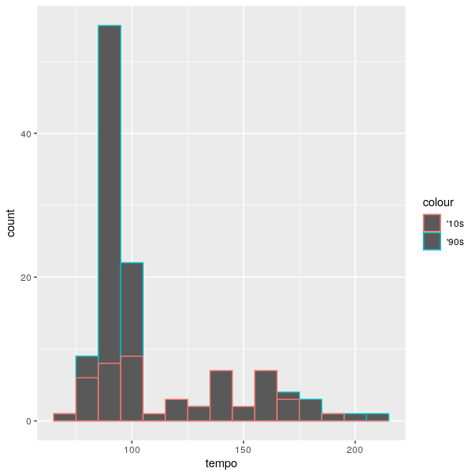

```{r setup, include=FALSE}
knitr::opts_chunk$set(echo = TRUE)
```

# Computational Musicology
## Content
- [Corpus](#corpus)
  * [Chosen Corpus](#chosen-corpus)
  * [Characteristics of the Corpus](#characteristics-of-the-corpus)
  * [Representativeness of the Corpus](#representativeness-of-the-corpus)
  * [Typical and Atypical Tracks](#typical-and-atypical-tracks)
- [Including Plots](#including-plots)

## Corpus
### Chosen Corpus
I will be using two Spotify playlists, namely ["Best Rap Songs of 2000"](https://open.spotify.com/playlist/37i9dQZF1DX38t16fuNXJJ?si=4f83c993c8904728) and ["I Love My '90s Hip-Hop"](https://open.spotify.com/playlist/37i9dQZF1DX186v583rmzp?si=9ea41443c20e40f1). They respectively have fifty and a hundred songs in them. I chose this corpus, since I am a big fan of '90s Hip-Hop and I am curious how the Hip-Hop genre has changed in the next decade.

### Characteristics of the Corpus
Both playlists consist of various artists and albums. They only have the genre in common: Hip-Hop. I expect Hip-Hop songs from the '90s to be more alike, as they often use samples or jazz influences in their songs. I also expect Hip-Hop songs from the 2000's to have a higher dancebility, as the Hip-Hop genre became more widely made. I am unsure if both playlists have a wide time range from their decade. 

### Representativeness of the Corpus
The corpus has more '90s songs then 2000's songs, so the 90's are more represented. Both playlists consist of a broad range of different artists from their decade, but also some songs of the same artists. This could be a limitation of the corpus. 

### Typical and Atypical Tracks
A typical track from the '90s playlist is [Do for Love by 2Pac](https://open.spotify.com/track/4AE7Lj39VnSZNOmGH2iZaq?si=d1ee18d3341a4cee). It uses a sample and from the '70s and has very meaningful lyrics. An atypical track from the '90s playlist is [Insane in the Brain by Cypress Hill](https://open.spotify.com/track/1oTHteQbmJw15rPxPVXUTv?si=330f37b1dad84b14), as it has a very different vibe as opposed to the other songs in the playlist.
A typical track from the 2000's playlist is [Ms. Jackson](https://open.spotify.com/track/0I3q5fE6wg7LIfHGngUTnV?si=d768963fb4b74e6d). This song has a sung chorus and rapped verses, like many of the other songs in the playlist. An atypical track from the 2000's playlist is [Ride Wit Me by Nelly and City Spud](https://open.spotify.com/track/3Gf5nttwcX9aaSQXRWidEZ?si=2b3a0b5373c448c7). This song has more singing in it than most of the other songs. 

## Including Plots
This plot shows the tempo distribution of the tracks in the 1990's and the 2010's playlist. The '90s playlist shows a large peak in the lower BPM, while the '10s have a more equally distributed BPM.





In the next plot the speechiness feature of both playlists is plotted. The songs from 2010 have less speechiness than the '90s. A possible cause of this could be the "popifying" of Hip-Hop and adding more singing to the tracks. 


The last plot shows the duration of a song vs the danceability. The size of a point shows how high the acousticness is. An immediate standout is that the '90s songs seem to have a higher danceability than most '10s tracks. Except for a single outlier, most songs seem to have about the same duration. The acousticness does not seem to correlate to the duration or danceability. 


Note that the `echo = FALSE` parameter was added to the code chunk to prevent printing of the R code that generated the plot.
