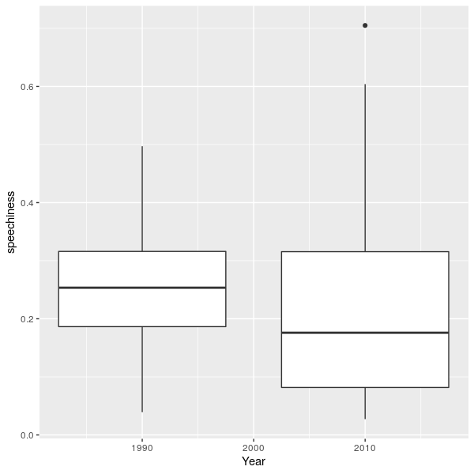
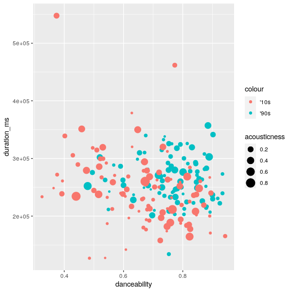

```{r setup, include=FALSE}
knitr::opts_chunk$set(echo = TRUE)
```

## R Markdown

This is an R Markdown document. Markdown is a simple formatting syntax for authoring HTML, PDF, and MS Word documents. For more details on using R Markdown see <http://rmarkdown.rstudio.com>.

When you click the **Knit** button a document will be generated that includes both content as well as the output of any embedded R code chunks within the document. You can embed an R code chunk like this:

```{r cars}
summary(cars)
```

## Including Plots

This plot shows the tempo distribution of the tracks in the 1990's and the 2010's playlist. The '90s playlist shows a large peak in the lower BPM, while the '10s have a more equally distributed BPM.

In the next plot the speechiness feature of both playlists is plotted. The songs from 2010 have less speechiness than the '90s. A possible cause of this could be the "popifying" of Hip-Hop and adding more singing to the tracks. 


The last plot shows the duration of a song vs the danceability. The size of a point shows how high the acousticness is. An immediate standout is that the '90s songs seem to have a higher danceability than most '10s tracks. Except for a single outlier, most songs seem to have about the same duration. The acousticness does not seem to correlate to the duration or danceability. 


Note that the `echo = FALSE` parameter was added to the code chunk to prevent printing of the R code that generated the plot.
